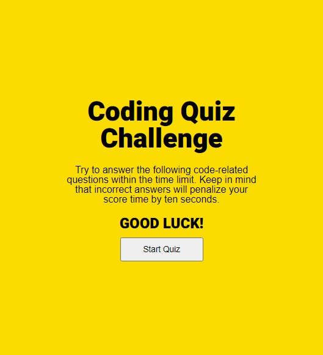
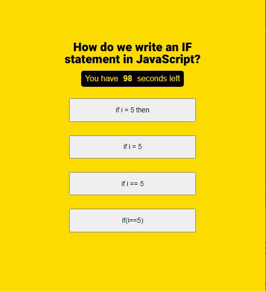
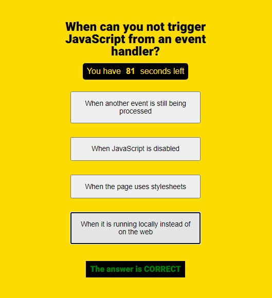
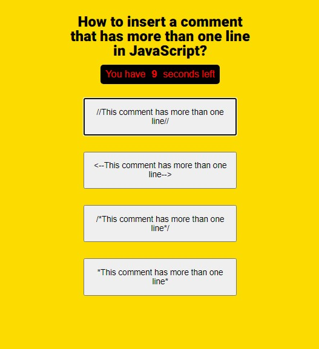
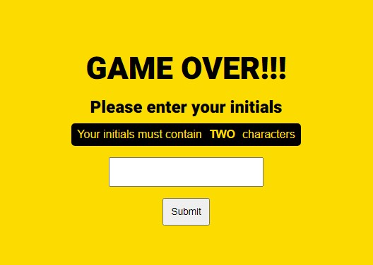
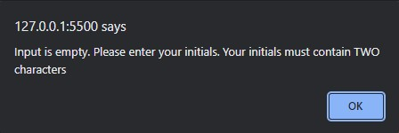
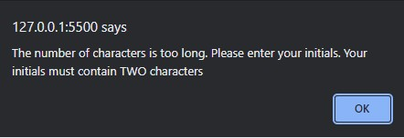
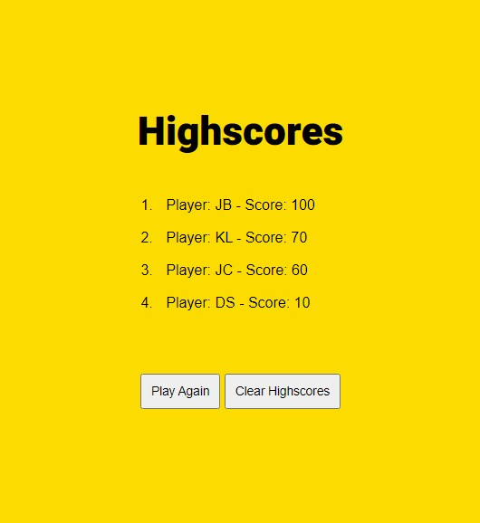
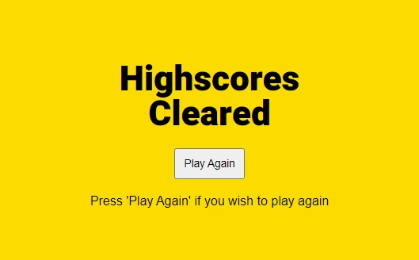

# hw-boot-wk04-Quiz

## The App
This is a timed JavaScript code quiz app with multiple choice questions. The app runs in a browser which is responsive using HTML, CSS and JavsScript. 

## How it works
The first page is loaded with instrustions how to complete the quiz. The user presses the "Start Quiz" button when ready to start. 

When the "Start Quiz" button is pressed, a question a with multiple choice answers is displayed with a countdown timer. 

When the user chooses an answer, the next question is displayed with the same display format as the previous one. A message is flashed to inform the user if the answer is correct or wrong. If the answer is correct, the message text will be green in colour otherwise, the message text will be red and ten seconds is deducted from the time left.

The timer text colour changes to red when there is 10 seconds or less left. 

When all questions are answered or if the timer reaches zero, the user is asked to input his initials with two characters. It does not matter if the input is lowercase. It will be converted to uppercase. 

If the initials input is empty, the following alert is popped: 

If the initials is too long, the following alert is popped: 

When the input is validated, the page displays the list of highscores, sorted descendently by the highest score. The user can either choose to play again or clear the highscores list. 

If the user chooses to play again, the game will restart. If the user chooses to clear the highscores list, the highscores list is deleted from localstorage and the following page is displayed: 

## Link to deployment application

https://bernardjbs.github.io/hw-boot-wk04-Quiz/